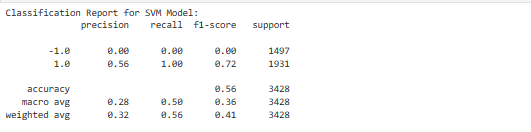

# StockBot
#### A simple stock trader created by [Demi Oyebanji](mailto:oluwademiladeoyebanji@outlook.com) 

## Major Functionality
The bot uses Machine Learning Classifiers to determine whether a stock should be bought based on its long-term or short-term potential

### Determining the Training Data based on simple logic
Calculated actual returns (pct change in Close Price) and used them to generate a signal column value
1.0 for buy -1.0 for sell and 0 for hold

The dataset had way more buy signals than sell signals

### Trained 2 Machine Learning Models with varying levels of accuracy when it comes to determining whether a stock should be bought or sold

**Model 1 Classification Report:**

Better at determining positions to sell a stock

**Model 2 Classification Report:**

Better at determining positions to buy a stock